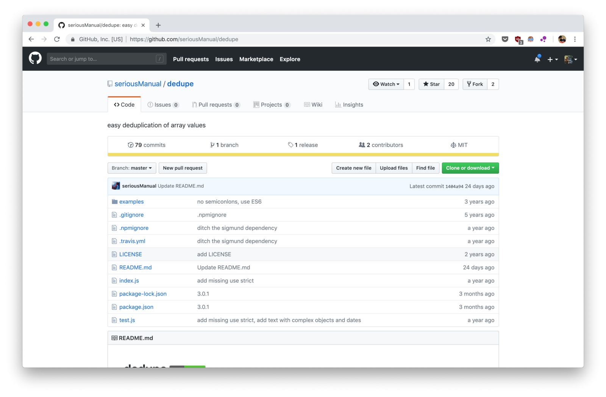

If you are not new in the JavaScript world, you might have already heard about [npm](https://www.npmjs.com/). It is a package manager that let developers easily add packages to a project, as `npm install hello-world`. But, have you ever asked "How do I create and publish my own packages"?

## How a package is composed?

Packages are quite simple in JavaScript. A `package.json` and `index.js` can already do the job. Look at this micro package called `dedupe` for example:



There are other useful files such as `.gitignore` and `.npmignore`, `LICENSE` and `README.md`, but the main ones are there: `package.json` and `index.js`.  Having these, the package just need to be published in a repository, such as the [npm public](https://www.npmjs.com/). Through this guide, you will be able to have a simple package created and published on npm.

## Create a npm package

While doing [apimock.in](https://apimock.in), I had to create multiple serverless stacks. Each have error handlers and, as most of the errors are quite the same, one strategy is to extract these definitions into a package and just install it on each serverless stack. I will use this case as the example through this post.

### Create a npmjs.com account

Before doing anything, an account on [npmjs.com](https://npmjs.com) is required for publishing a package. This is the website for the npm public repository, the one which is used when  `npm install ...` is executed.

To create an account, go to [npm signup page](https://www.npmjs.com/signup) and fill up the informations. After finishing the process, a test can be done using `npm login` and `npm whoami`. Has it output your username? Great! It is working!


### Some words about scopes

Scopes are useful in many ways, although not strictly required to publish a npm package. Every npm user has its own scope, defined as the npm user name.

As only the developer/company can publish to its own scope, it is quite useful to indicate it is an official package. For example, one can publish a package called `xyz-sdk`, but another called `xyz` might already exist. How one would now which to install? What if `xyz` mimics `xyz-sdk`, but with malicious code?

> Each npm user/organisation has their own scope, and only you can add packages in your scope. This means you don’t have to worry about someone taking your package name ahead of you. Thus it is also a good way to signal official packages for organisations. ([from npm-scopes documentation](https://docs.npmjs.com/misc/scope))

A scoped package would have  a `@account` prefix. It would be published as `@account/xyz-sdk`, hence easily identifiable as from a specific developer. Besides, the developer don't have to worry about name clashing, as the scope is account specific. It can be configured to point to a private repository as well,
making it specially useful for companies.

There are [more information about scopes here](https://docs.npmjs.com/misc/scope). Keep in mind it is a good practice to scope packages.

### Create a simple package structure

In an empty folder, run `npm init —-scope=@your-npm-user`. This will setup a `package.json` and ask for some informations, such as name, version, main entry file and author. The end result will be something as the following.

```
{
  "name": "@brunoluiz/jsonapi-errors",
  "version": "0.1.0",
  "description": "JSONAPI Common Errors",
  "main": "index.js",
  "scripts": {
    "test": "jest"
  },
  "author": "Bruno Luiz da Silva <contact@brunoluiz.net> (http://brunoluiz.net/)",
  "license": "MIT"
}
```

After having it initialised, is time to code something. Develop a basic implementation of it in the specified main file on `npm init` setup (usually `index.js`). If the package require dependencies or there are files to be ignored on publishing, add a `.gitignore` with what should be ignored (eg: `node_modules`).

It is suggested to add a `LICENSE.md` and a `README.md`, as other developers might use this package. For more informations about licensing, check [choosealicense.com](https://choosealicense.com/).

### Publish the package

The basic implementation is done and now is time to deploy it! For the first publish, a `npm publish -—access=public` is required. The `access=public` param is needed as, by default, it tries to do it as private. On following publishings, a `npm publish` will do the job.

Congratulations! You published your first package on npm. It should be available at `https://npmjs.com/package/@your-npm-user/package-name` and ready to be installed through `npm install @your-npm-user/package-name`.


### Releasing new versions

After some iterations, the package might need new features. In the example above, `jsonapi-errors` only have a `index.js` which prints a "hello world" (quite useless). After adding a real implementation, a version bump is required.

NPM packages uses semantic versioning. The is [more information about it here](https://semver.org/), but in a nutshell:

> MAJOR version when you make incompatible API changes,
>
> MINOR version when you add functionality in a backwards-compatible manner, and
>
> PATCH version when you make backwards-compatible bug fixes.

In the `jsonapi-errors` example, a minor version increment is required. To do this, a `npm version minor` can be used, where it will bump the `package.json` version and add a git commit + tag. Then, a `npm publish` will take care of pushing it (no need for `access` parameter now).

There are [more information about the versioning process here](https://docs.npmjs.com/cli/version.html).


### Testing on projects and going beyond npm install

A simple way to test the shinny new package is through `npm install`. It will work as expected but, if a change is required, a new version has to be published and the project dependency has to be upgraded to use the new one.

This is unproductive, specially when a package is new and changes happen quite often. A way to solve it is through `npm link`: it creates a symbolic link of the package, inside the project `node_modules` folder, where it will use the local version of the module.

< … to be developed … >

## Automate publishing process using CircleCI

If a package have many people collaborating to it, or the deploy process require many extra steps besides publishing it, perhaps an automated setup can improve the workflow. I prefer to use CircleCI, but there are other options such as TravisCI and GitLab CI.

On CircleCI Blog there is a [complete article explaining how to do it](https://circleci.com/blog/publishing-npm-packages-using-circleci-2-0/). The final configuration will enable to:

1. On feature branches, it will just run tests (eg: run tests on pull requests)
1. On git `v*.*.*` tag pushes, it will run tests and then publish to the NPM repository  —  remembering, a git version tag is generated by `npm version` 

More configurations can be added, such as saving coverage reports to a bucket or triggering specific web hooks after the jobs (eg: Slack).

## Where to go now?

The steps shown in this article will cover most basic necessities on npm package publishing, but there are some specifics I haven't covered in this article.

1. **Publish the package as TypeScript:** this allows code typing, more robust codes and, in editors such as VS Code, it enables a batter IntelliSense. [There is a quite complete article on
ITNext](https://itnext.io/step-by-step-building-and-publishing-an-npm-typescript-package-44fe7164964c).
1. **Publish it to a private repository:** there are some small different configurations, as pointing the package scope to the private repository. [Give a look in this npm article](https://docs.npmjs.com/creating-and-publishing-private-packages).
