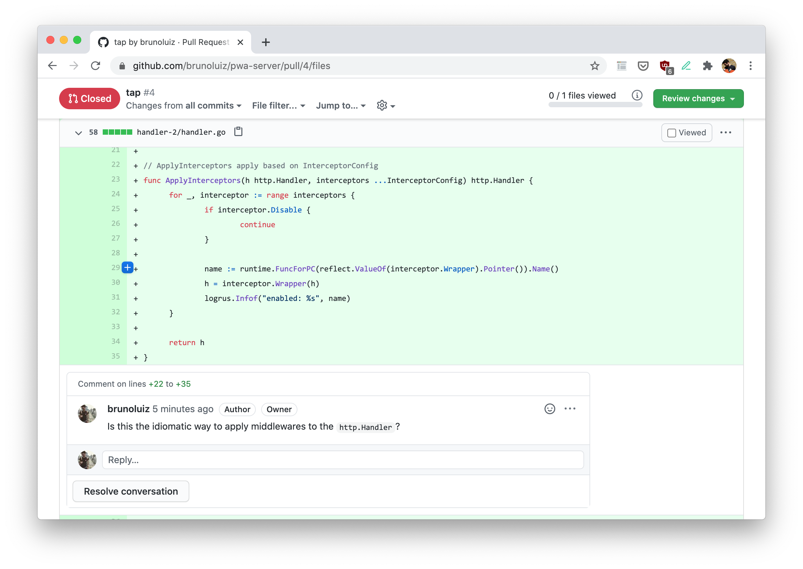
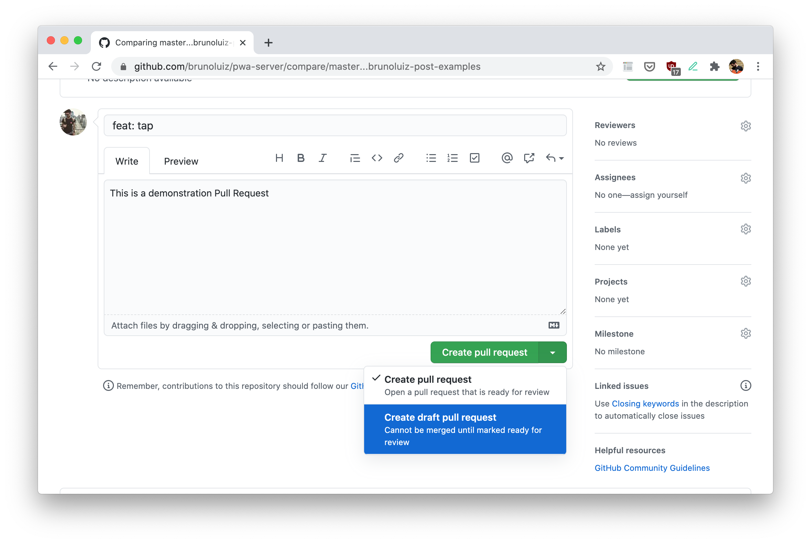
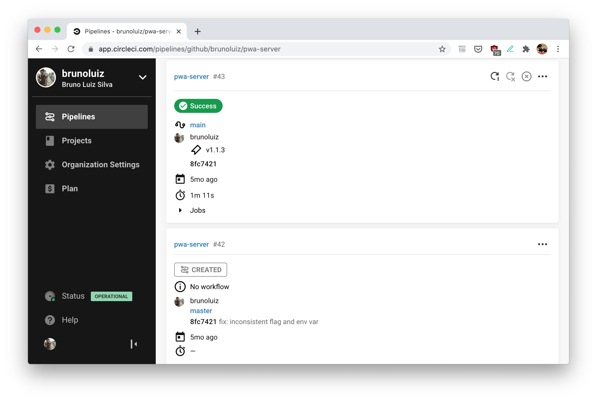

Every software developer, soon after pushing code to the repository, has this urge to ping the team to ask for code review. But, I dare to say: don't do it! Most likely the code will still have some issues, especially if this is your first push for this feature.

The following guidelines might help you to get better and faster code reviews.

_Disclaimer: I am using some Github terminology (Pull Request, Draft PR), but it should apply to other repository hosting services._

# Be your first reviewer

As mentioned, many might be eager to ask for reviews straight away. But what if your first reviewer was you? Check the code for usual issues, such as unnecessary comments, intricated logic or even some test script you wrote and committed by accident (who never?)

It will already clear the way for teammates to focus on what matters for the feature.

# Create small Pull Requests (if possible)

Sometimes we might end-up including too much code in one Pull Request. Splitting it into small ones will make reviewers lives easier.

It will narrow down the feature scope, and it might raise some interesting discussions before going ahead with more implementations. Besides, smaller amounts of code are faster to review.

Examples of splittable code:

-   Updates on schemas or any type model, as the team might want to discuss it before going ahead
-   Tooling updates (scripts or shared libs/SDK), as it might be of interest of other people outside the team
-   If there is a story ticket with sub-tasks, use the sub-tasks as a guide for opening pull requests

# Use comments to open early discussion

Most repository hosting services have tools to allow developers to comment in pull requests. As you review your code, you might want to:

1.  Discuss if an implementation is the best approach to the problem or if it is consistent with similar features
2.  Discuss if [the code is idiomatic][1] for the language or framework
3.  Point-out to possible breaking changes or disruptive codes (example: possible data loss)
4.  Point out relevant bits of the code, where much of the logic happens

Of course, these are suggestions and not all pull requests need discussions.

# If working with big teams, drafts might help

Sometimes, people get stuck in some part, and that is where asking your mates might be a good call. Push, open a pull request, label as "WIP" and send it to some people... right?

The problem with this approach is that, in big teams, many code owners might be associated with this project. Usually, members are automatically notified on pull requests, and some people might not like the noise (e-mails, Github bots and so on).

Most services have the concept of "draft pull request", which do not automatically request reviews from the code owners. For work in progress pull requests, this is quite helpful and highly recommended.

Once it is ready for review, you can convert from draft to pull request and profit 😉.

# Descriptions always help

The team might exactly know what to expect for this feature, and there might be even a ticket with more details. But humans tend to forget details, and a clear description of what is supposed to do might be helpful.

If there is a ticket, replicating some bits in the description might be helpful as well. Someone might need to come back to it, or even other teams might want to peek into it. Most likely, just a few will remember details and this description could be of huge help in these moments.

# Continuous integration: automation, automation...

Humans make mistakes. Who never pushed code with inconsistent formatting, logging calls, skipping some tests and so on? Reviewing these mistakes is a bit annoying (although doable), mostly because usually they could be 100% avoided.

With tools such as [CircleCI](https://circleci.com/) or [Github Actions](https://github.com/features/actions), a team can automate these tasks and mark the feature as "mergeable" only if all of those passed. It is what is called [continuous integration][2].

Things that could be easily automated:

-   Tests: if the project has them (it should), the commands to run them should be easy to include in the automation
-   Linting: checks if the code follows code guidelines decided by the team, enabling to catch bugs and other programming errors. Most languages have linting tools, with many available configurations (examples: ESLint, golangci-lint)
-   Building: from binaries to docker images, why not add this process to your automation pipeline?
-   Deploying: depending on the team workflow, it might be even possible to deploy these straight to staging or production (continuous delivery)
-   Publishing: if the project is some tool, it can publish in the specific platform (screenshot example)

These are just examples. Your team might have different requirements and tasks, which could be configured into your continuous integration.

# Don't be "the rockstar" coder

Besides all the above, be honest and genuine when asking questions, discussing topics or bringing new things (tooling, models, ways of code). Consider that people will spend some time to check your progress, and give feedback and recommendations. They are doing this genuinely, and so should you.

Don't be "that guy", the one who knows everything and whos opinion is the only that matters.

# Conclusion

I hope these steps are small enough to be easily integrated into your workflow. At some point, you might be able to convince other team members to use some of these as well. Integrate it in steps, to make it smoother to everyone 😉.

[1]: https://en.wikipedia.org/wiki/Programming_idiom
[2]: https://martinfowler.com/articles/continuousIntegration.html
